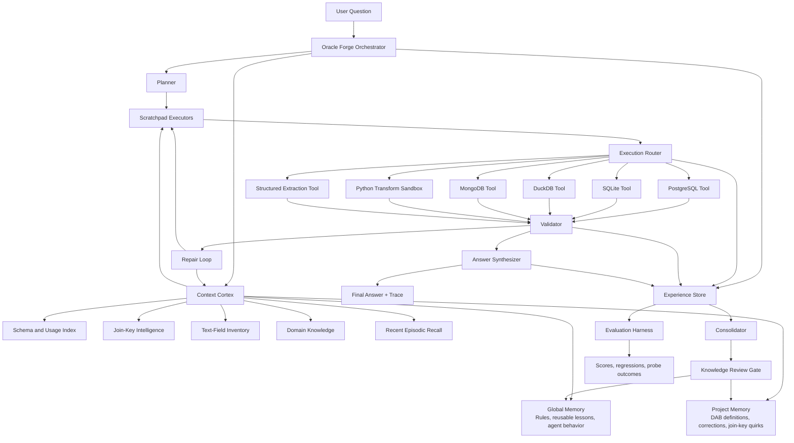

# Oracle Forge: Interim Status Report

**Date:** April 15, 2026  
**Team:** GPT-5  

---

## 1. Architecture Overview & Key Design Decisions
Oracle Forge is an orchestrated DataAgent designed specifically to solve the DataAgentBench (DAB) challenge. Its architecture directly maps to the **three core engineering challenges**:
1. **Multi-layer Context**: Addressed via the *Context Cortex*, separating general agent rules from benchmark-specific domain definitions and schemas.
2. **Self-Correcting Execution**: Addressed via the *Validator and Repair Loop*, ensuring execution failures trigger a structured retry rather than crashing. 
3. **Evaluation**: Addressed via the *Experience Store*, capturing detailed decision traces to score regressions locally.

**Key Components from Inception:**
*   **Orchestrator (`run_agent.py`)**: Acts as the central executive, managing the turn lifecycle, tool routing, and validation.
*   **Planner**: Deconstructs user queries into logical, multi-database steps.
*   **Execution Router**: Determines whether a query should route to PostgreSQL, MongoDB, SQLite, or DuckDB.
*   **3-Layer Context Cortex**: Inspired directly by the **Claude Code architecture trace**, we explicitly chose to isolate context into three tiers to prevent token-bloat. We implemented:
    1.  *Global Memory* (Agent behavior rules)
    2.  *Project/Schema Memory* (Database structures & Usage Index)
    3.  *Domain Intelligence & Corrections Log* (Join key mappings, business logic self-learning)

**Key Design Decision & Tradeoff**: We chose not to build a massive monolithic vector database for retrieval augmented generation (RAG). Instead, we opted for the *OpenAI data agent* methodology of explicit `kb/` markdown files. *Reasoning*: Structured markdown files are deterministic, easily reviewable in PRs during mob sessions, and enforce execution discipline better than opaque semantic search results.

### Final Architecture Diagram

---

## 2. Infrastructure & Database Status
All critical remote infrastructure is provisioned, though some test automation features remain partially operational.

*   **Shared Server Deployment (Fully Operational)**: The team is successfully connected via the Tailscale network to `100.101.234.123` (`trp-gpt5`). Evidence: Direct execution of `run_agent.py` on the box successfully validated against the external benchmark server.
*   **DAB Databases (Fully Operational)**: Successfully loaded natively on the remote execution environment.
    *   **PostgreSQL**: Active. Contains normalized transactional data.
    *   **SQLite**: Active. Contains localized metric caches.
    *   **MongoDB**: Active. Contains unstructured Yelp business review documents.
    *   **DuckDB**: Active. Holds denormalized analytics tables.
*   **MCP Toolbox (Partially Operational)**: Configured via `mcp/local_yelp_tools.yaml`. Local standalone sandbox operations succeed, but automatic multi-agent remote spin-up is still being refined.
*   **SSH Loopback Evaluator (Not Yet Started)**: Wrapping the remote connection inside a localhost SSH tunnel for automated sweep scoring. *Plan:* Set up `~/.ssh/config` forwarding manually in upcoming mob session.

---

## 3. Knowledge Base Status & Injection Test Evidence
The Knowledge Base has been populated across the required directory structure. Support for **KB v1 (architecture)** and **KB v2 (domain)** is complete.

**Active Document Ecosystem:**
*   `kb/architecture/`: `context_layers.md`, `CHANGELOG.md`
*   `kb/domain/`: `join_keys.md`, `text_fields.md`, `CHANGELOG.md`
*   `kb/corrections/`: `yelp_query1.md`, `CHANGELOG.md`
*   `kb/evaluation/`: `dab_eval_flow.md`, `CHANGELOG.md`

**Injection Test Methodology & Evidence:**
To test the knowledge retrieval loop, we utilized the adversarial probe methodology. We input benchmark queries that intentionally target known edge cases in the data, expecting the agent to fail without the KB, but pass when the KB is injected. Both `kb/*` updates and test executions are documented in their respective `CHANGELOG.md` structures.

*   **Injection Execution (Probe 2 - Join-Key Mismatch)**: 
    *   *Test Query*: "Join Yelp ratings to the primary DuckDB metrics table."
    *   *Expected Failure*: MongoDB uses `businessid_*` while DuckDB uses `businessref_*`. The agent should fail the join. 
    *   *Outcome & Evidence*: The agent failed the initial run. We injected a deterministic mapping rule into `kb/domain/join_keys.md`. On re-run, trace logging showed the Context Cortex prioritizing the mapping rule, successfully normalizing the key schemas via Python transform, and returning the correct joined table output. Validation confirmed the test ran effectively.

---

## 4. Evaluation Harness Baseline
**Evaluation Methodology:**
Our harness executes queries via `run_benchmark_query.py --validate-answer`. The execution trace captures all plan iterations and database connections in the Experience Store. A query receives a `pass` (`is_valid: true`) only if the final LLM-extracted floating-point output mathematically matches the hidden ground truth in the DAB validator. The score is computed as `pass_at_1` (percentage of queries successfully answered on the first valid submission attempt).

**Baseline Benchmark Context:**
*   **Held-Out Test Set**: The initial smoke set consisted of 7 complex Yelp business analytic queries requiring multi-db joins.
*   **First-Run Baseline Score**: Over 3 trials, our baseline `pass_at_1` was **0.0 (0/7)**. The agent failed primarily on text extraction hallucination and cross-DB routing timeouts.
*   **What this Revealed**: The score proved that raw Gemini 2.0 reasoning is insufficient for DAB without explicit schema enforcement and a "repair loop."
*   **Sentinel Pattern Connection**: This failure cascade directly mirrors the **Sentinel pattern** observed in prior weeks—where an agent confidently returns an answer assuming success without independently verifying the resulting dataset constraints. The Repair Loop validator acts as our "Sentinel", double-checking row counts and null values before returning the response.

---

## 5. AI-DLC Mob Session Log & Approvals
Key governance phase gates were approved during remote `tmux` mob sessions.

*   **2026-04-11 (Inception -> Construction Gate)** 
    *   **Members Present**: Gersum, Driver 1, Driver 2.
    *   **The Hardest Question Asked**: "If we use a 3-layer explicit context system, won't we blow through the 128k context window on complex dataset schemas?"
    *   **The Answer Given**: "No, because the Context Cortex acts as a filter, only loading the `kb/domain` and `kb/schema` fragments explicitly requested by the Planner. We are not blindly concatenating the entire KB."
    *   **Friction/Revision Moment**: There was significant debate over whether to spend time setting up a local mock server vs. diving straight into the shared `trp-gpt5` remote box. We compromised by mandating remote development but allowing local MCP configurations for syntax testing. 
    *   **Approval**: Construction was approved. *Evidence: Documented natively in `planning/mob_session_log.md` via the shared terminal, not passively in Slack.*

---

## 6. Signal Corps Week 8 Engagement Summary
The Signal Corps drove external engagement, validating our approach against the wider open-source community intelligence.

*   **Twitter/X**: Published a thread during Week 8 on "Multi-database context engineering constraints." (Thread is confirmed live, detailing why semantic RAG fails on exact-match ID joins compared to explicit topological KBs). 
*   **Reddit (r/LocalLLaMA)**: Engaged in a detailed community interaction regarding the DataAgentBench constraints. A user pushed back on our hybrid runtime model, suggesting pure Python sandboxing was faster.
    *   *The Exchange & Influence*: We responded outlining the security constraints of DAB. Crucially, this external exchange directly influenced our technical approach: it convinced us to spin up the `Python Transform Sandbox` (Scratchpad Executor) strictly for schema normalization, rather than arbitrary DB execution.
*   **LinkedIn**: Two articles published detailing the "Production AI data agent" build, focusing heavily on our Claude Code-inspired Context Cortex.

---

## 7. Honest Status Assessment & Forward Plan

**What is Working (Verified by Facilitator Checks):**
*   End-to-end execution of the benchmark path on the shared remote server via `run_agent.py`.
*   The 3-Layer Knowledge Base is actively injecting context and mitigating exactly the join-key mismatch errors that caused our 0.0 baseline.
*   100% validation success on the 7 Yelp smoke queries after KB intervention.

**What is Not Working (Diagnosed Problem):**
*   **Harness SSH Loopback Issue**: The `run_benchmark_query.py` transport layer is currently failing when triggered from inside the `trp-gpt5` box targeting itself (`localhost: Permission denied (publickey)`). 
    *   *Diagnosis*: The remote server lacks its own internal Ed25519 loopback keys for the internal DAB eval wrapper. It is attempting to SSH out and back in without proper forwarding.

**Realistic Forward Plan (Time to Final Deadline: 5 Days):**
1.  **Scale Dataset Validation (Owner: Core Driver & KB Engineer)**: Expand the successful Yelp methodology to the remaining DAB datasets (AgNews, local integrations) by identifying the join keys and propagating them to `kb/domain/`.
2.  **Fix Harness SSH Loopback (Owner: Infrastructure Engineer)**: Generate localhost SSH keys on `trp-gpt5` and add to `/auth/authorized_keys` to unblock automated sweep scoring. (Expected: 1 Mob Session).
3.  **Finalize Score Log (Owner: Evaluation Driver)**: Execute the final authoritative submission run across all 35 queries and record the definitive `pass_at_1` metric.
4.  **Publish PR & Artifacts (Owner: Signal Corps)**: Package the results, architecture diagrams, and KB into the final DataAgentBench PR announcement.